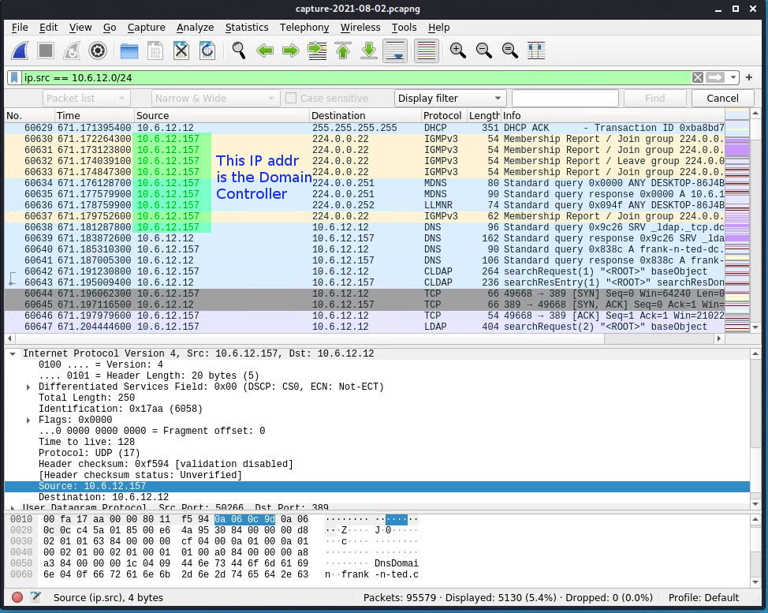
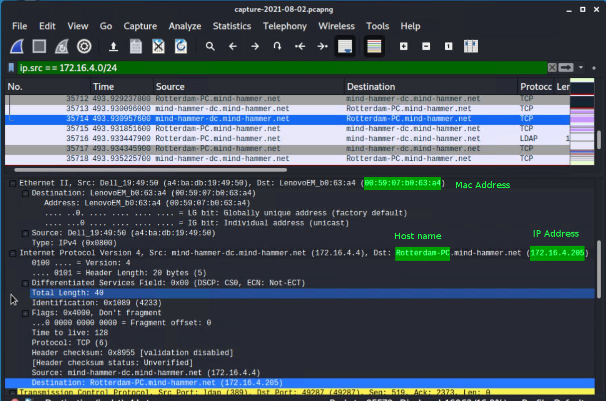
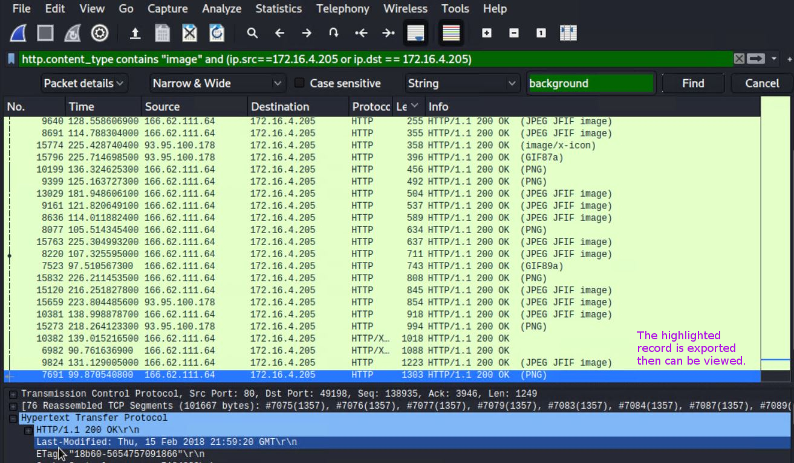
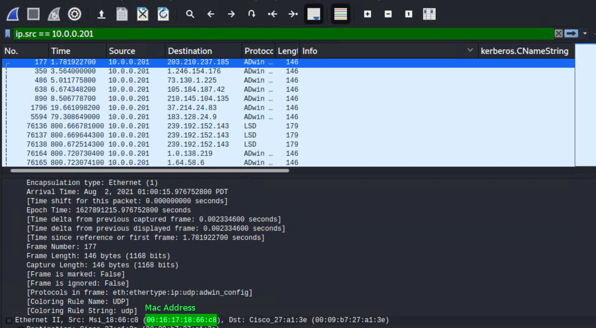
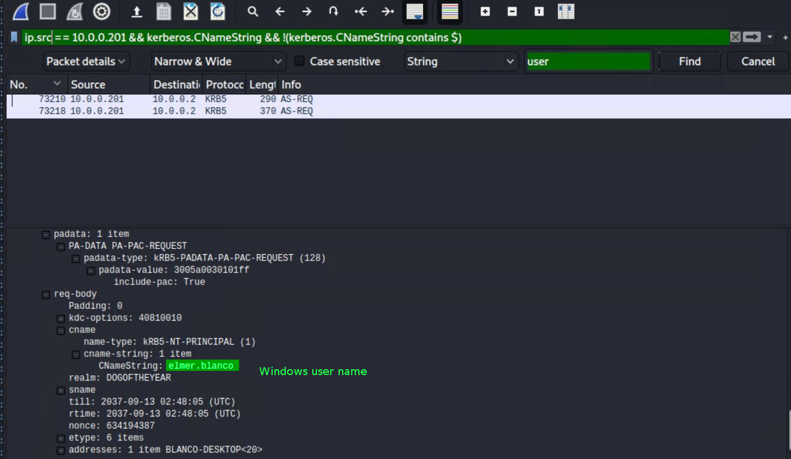
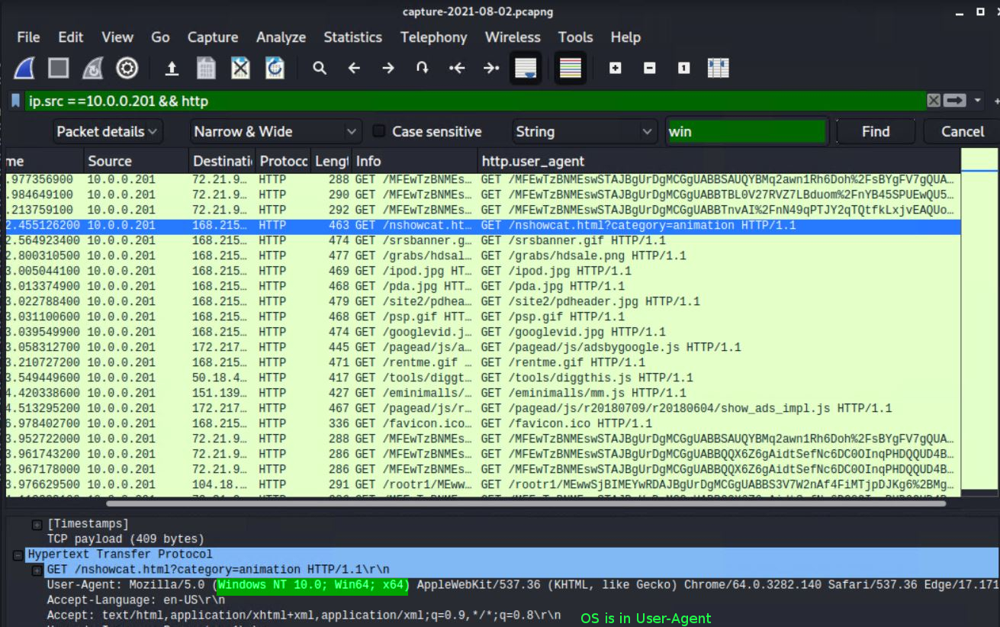

# Network Forensic Analysis Report

## Time Thieves 
You must inspect your traffic capture to answer the following questions:

1. **What is the domain name of the users' custom site?**

frank-n-ted.com

2. **What is the IP address of the Domain Controller (DC) of the AD network?**

10.6.12.157

3. **What is the name of the malware downloaded to the 10.6.12.203 machine?**
 
june11.dll

4. Upload the file to [VirusTotal.com](https://www.virustotal.com/gui/). What kind of malware is this classified as?

Trojan

---

## Vulnerable Windows Machine

1. **Find the following information about the infected Windows machine:**

    - **Host name:** Rotterdam-PC
    - **IP address:** 172.16.4.205
    - **MAC address:** 00:59:07:b0:63:a4
    
    
   
2. **What is the username of the Windows user whose computer is infected?**

   matthijs.devries
   
   
   
3. **What are the IP addresses used in the actual infection traffic?**

   **185.243.115.84**

   When viewing the Conversations between 172.16.4.205 and other IP addresses, 185.243.115.84 had the most number of packets and largest bytes.
   
   
   
4. **As a bonus, retrieve the desktop background of the Windows host.**

   I found the records which went to/from 172.16.4.205 and had http.content_type contain "image" and then searched the packets for the string "background".
   
    
   
   
   
---

## Illegal Downloads

1. **Find the following information about the machine with IP address `10.0.0.201`**:

    - **MAC address:** 00:16:17:18:66:c8

    
    
    - **Windows username:** elmer.blanco

    After reading https://www.wireshark.org/docs/dfref/s/smb_netlogon.html, I thought that `smb_netlogon.user_name` should show the user name \([it did not work](illegal_downloads1_win_user_not_working.JPG)\) and that `smb_netlogon.os_version` should show the OS version \([it did not work](illegal_downloads1_win_os_not_working.JPG)\).

   I repeated the technique from *Vulnerable Windows Machine* Q2.
   
    
    
    - **OS version:** Windows NT 10.0

    Found OS version in User Agent information.
    
    
    
  

2. **Which torrent file did the user download?**

    Betty_Boop_Rhythm_on_the_Reservation.avi.torrent

    
