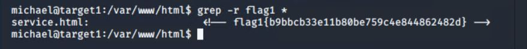

# Red Team: Summary of Operations

## Table of Contents
- Exposed Services
- Critical Vulnerabilities
- Exploitation

### Exposed Services

Nmap scan results for each machine reveal the below services and OS details:

```bash
$ nmap -sV 192.168.1.110
Nmap scan report for 192.168.1.110
Host is up (0.0013s latency).
Not shown: 995 closed ports
PORT    STATE SERVICE     VERSION
22/tcp  open  ssh         OpenSSH 6.7p1 Debian 5+deb8u4 (protocol 2.0)
80/tcp  open  http        Apache httpd 2.4.10 ((Debian))
111/tcp open  rpcbind     2-4 (RPC #100000)
139/tcp open  netbios-ssn Samba smbd 3.X - 4.X (workgroup: WORKGROUP)
445/tcp open  netbios-ssn Samba smbd 3.X - 4.X (workgroup: WORKGROUP)
MAC Address: 00:15:5D:00:04:10 (Microsoft)
Service Info: Host: TARGET1; OS: Linux; CPE: cpe:/o:linux:linux_kernel
```

This scan identifies the services below as potential points of entry:
- Target 1

| Port     | Service      | Service Description and Version              |
|----------|--------------|----------------------------------------------|
| 22/tcp   | ssh          | OpenSSH 6.7p1 Debian 5+deb8u4 (protocol 2.0) |
| 80/tcp   | http         | Apache httpd 2.4.10 ((Debian))               |
| 111/tcp  | rpcbind      | 2-4 (RPC #100000)                            |
| 139/tcp  | netbios-ssn  | Samba smbd 3.X - 4.X (workgroup: WORKGROUP)  |
| 445/tcp  | netbios-ssn  | Samba smbd 3.X - 4.X (workgroup: WORKGROUP)  |

_TODO: Fill out the list below. Include severity, and CVE numbers, if possible._

The following vulnerabilities were identified on each target:
- Target 1

| Service and Vulnerable Versions                     | Severity (CVSS V3.x)     | CVE             |
|-----------------------------------------------------|--------------------------|-----------------|
| OpenSSH 5.x, 6.x, and 7.x before 7.1p2              | 6.5 Medium               | [CVE-2016-0777](https://nvd.nist.gov/vuln/detail/CVE-2016-0777) |
| OpenSSH 5.x, 6.x, and 7.x before 7.1p2              | 8.1 High                 | [CVE-2016-0778](https://nvd.nist.gov/vuln/detail/CVE-2016-0778) |
| Apache HTTP Server versions 2.4.6 to 2.4.46         | 5.3 Medium               | [CVE-2019-17567](https://nvd.nist.gov/vuln/detail/CVE-2019-17567) |
| Apache HTTP server 2.4.0 to 2.4.39                  | 6.1 Medium               | [CVE-2019-10098](https://nvd.nist.gov/vuln/detail/CVE-2019-10098) |
| Apache HTTP Server 2.4.0-2.4.39                     | 6.1 Medium               | [CVE-2019-10092](https://nvd.nist.gov/vuln/detail/CVE-2019-10092) |
| Apache HTTP Server 2.4.0 to 2.4.38                  | 5.3 Medium               | [CVE-2019-0220](https://nvd.nist.gov/vuln/detail/CVE-2019-0220) |
| Apache HTTP Server 2.4 release 2.4.38 and prior     | 7.5 High                 | [CVE-2019-0217](https://nvd.nist.gov/vuln/detail/CVE-2019-0217) |
| Apache HTTP Server prior to version 2.4.30          | 7.5 High                 | [CVE-2018-1303](https://nvd.nist.gov/vuln/detail/CVE-2018-1303) |
| Apache httpd 2.4.0 to 2.4.29                        | 5.3 Medium               | [CVE-2018-1283](https://nvd.nist.gov/vuln/detail/CVE-2018-1283) |
| Apache httpd 2.2.x 2.4.x before 2.4.26              | 9.8 Critical             | [CVE-2017-3169](https://nvd.nist.gov/vuln/detail/CVE-2017-3169) |
| Apache httpd 2.4.x before 2.4.26                    | 9.8 Critical             | [CVE-2017-3167](https://nvd.nist.gov/vuln/detail/CVE-2017-3167) |
| Apache httpd 2.4.0 to 2.4.29                        | 8.1 High                 | [CVE-2017-15715](https://nvd.nist.gov/vuln/detail/CVE-2017-15715) |
| Apache HTTP Server, in all releases prior to 2.4.25 | 7.5 High                 | [CVE-2016-8743](https://nvd.nist.gov/vuln/detail/CVE-2016-8743) |
| Apache HTTP Server versions 2.4.0 to 2.4.23         | 7.5 High                 | [CVE-2016-2161](https://nvd.nist.gov/vuln/detail/CVE-2016-2161) |
| Apache HTTP Server versions 2.4.0 to 2.4.23         | 7.5 High                 | [CVE-2016-0736](https://nvd.nist.gov/vuln/detail/CVE-2016-0736) |
| Apache HTTP Server 2.4.x before 2.4.14              | 4.3 Medium (CVSS V2.0)   | [CVE-2015-3185](https://nvd.nist.gov/vuln/detail/CVE-2015-3185) |
| Apache HTTP Server before 2.4.14                    | 5.0 Medium (CVSS V2.0)   | [CVE-2015-3183](https://nvd.nist.gov/vuln/detail/CVE-2015-3183) |
| Apache HTTP Server 2.3.x and 2.4.x through 2.4.10   | 4.3 Medium (CVSS V2.0)   | [CVE-2014-8109](https://nvd.nist.gov/vuln/detail/CVE-2014-8109) |
| Apache HTTP Server 2.4.10                           | 5.0 Medium (CVSS V2.0)   | [CVE-2014-3583](https://nvd.nist.gov/vuln/detail/CVE-2014-3583) |
| Apache HTTP Server before 2.4.11                    | 5.0 Medium (CVSS V2.0)   | [CVE-2014-3581](https://nvd.nist.gov/vuln/detail/CVE-2014-3581) |
| Apache HTTP Server versions 2.4.0 to 2.4.46         | 7.5 Medium (CVSS V2.0)   | [CVE-2021-26691](https://nvd.nist.gov/vuln/detail/CVE-2021-26691) |
| Apache HTTP Server versions 2.4.0 to 2.4.46         | 7.5 High                 | [CVE-2021-26690](https://nvd.nist.gov/vuln/detail/CVE-2021-26690) |
| Apache HTTP Server versions 2.4.0 to 2.4.46         | 7.3 High                 | [CVE-2020-35452](https://nvd.nist.gov/vuln/detail/CVE-2020-35452) |
| Apache HTTP Server 2.4.0 to 2.4.41                  | 5.3 Medium               | [CVE-2020-1934](https://nvd.nist.gov/vuln/detail/CVE-2020-1934) |
| Apache HTTP Server 2.4.0 to 2.4.41                  | 6.1 Medium               | [CVE-2020-1927](https://nvd.nist.gov/vuln/detail/CVE-2020-1927) |
| Apache HTTP Server versions 2.4.41 to 2.4.46        | 7.5 High                 | [CVE-2020-13950](https://nvd.nist.gov/vuln/detail/CVE-2020-13950) |

`nmap -sV –script vulners –script-args mincvss=7.0 192.168.1.110`

[Results of nmap scan](nmap_target1_vulscan.txt)

### Exploitation
_TODO: Fill out the details below. Include screenshots where possible._

The Red Team was able to penetrate `Target 1` and retrieve the following confidential data:
- Target 1
  - `/var/www/html/service.html contains flag1`: b9bbcb33e11b80be759c4e844862482d
    - **Exploit Used**
      - Exploited weak password
         - Found a list of WordPress users (michael and steven)by running wpscan `wpscan –url http://example.com –enumerate u`
          [wpscan results](Target1/wpscan_user_enumerate.txt)
         - The user michael had an obvious password "michael" on both his WordPress and Target1 accounts
         - Logged in as michael and used grep to find flag1 inside /var/www/html/service.html
            `ssh michael@192.168.1.110`
         
            `cd /var/www/html`

            `grep -r flag1 *`

            
      
  - `/var/www/flag2.txt`: fc3fd58dcdad9ab23faca6e9a36e581c
    - **Exploit Used**
      - Exploited weak password (same exploit as in flag 1)
      -
            `cd /`

            `find . -name flag\* 2>/dev/null`
            
            `cat /var/www/flag2.txt`            

            
